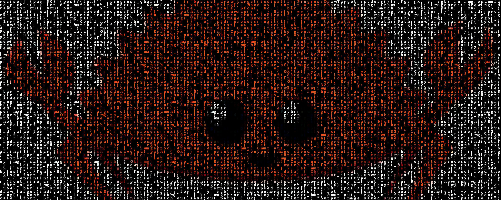

# blendit

Blend images with text and generate amazing looking posters.


## Build

[Install Rust](https://www.rust-lang.org/tools/install) if you haven't done it yet.

Clone this repository in a new directory and `cd` into it.

```
git clone https://github.com/alexvilanovab/blendit
```

```
cd blendit
```

Compile the project using `--release` flag so that it is fully optimized.

```
cargo build --release
```

That's it! You will be able to find the compiled binary at `target/release/blendit`.

## Usage

```
USAGE:
    blendit [OPTIONS]  <TXT>

FLAGS:
    -h, --help       Prints help information
    -V, --version    Prints version information

OPTIONS:
    -f, --font-size <UINT>    Font size used when generating the poster [default: 24]
    -o, --output         Where you want to save the JPEG with the generated poster [default: ./output.jpg]

ARGS:
        Image you want to blend
    <TXT>    Text file you want to blend
```

## How to get better results

- Use small images (`~150x150px` works good!). Have in mind that each pixel of the original image will be replaced by a character of `24x24px` (if `font-size` argument is not specified).

- Make sure that the images you use do not contain pure dark pixels. This would imply rendering a black character in a black background; hence, the character would not be visible.

## Ideas for future implementations

- Automatically resize and apply the needed color modifications to the original image in order to get a good result no matter how big or how dark it is.

- Add a configuration argument that applies a hue color to the generated poster. This looks really good, specially on grayscale images.

## Motivation

Even though I never published it I actually made exactly this same project using [Processing](https://processing.org) back in 2017. 

It wasn't until I found out about [emosaic](https://github.com/willdady/emosaic) that I decided to port it to [Rust](https://www.rust-lang.org).

By the way! these are my first lines of code using Rust so don't expect everything to be perfect.


